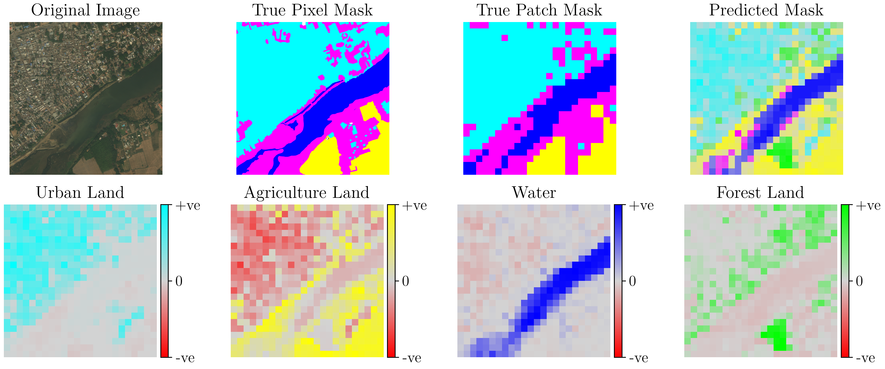

# Scene-to-Patch Earth Observation: Multiple Instance Learning for Land Cover Classification

This repo contains the code for the paper Scene-to-Patch Earth Observation: Multiple Instance Learning for Land Cover Classification.  
We use [Bonfire](https://github.com/JAEarly/Bonfire) for the backend MIL functionality.

Below we break down each of the directories in this repo:

### Config

Configuration for model parameters.

### Models

Contains the trained model files. Five repeats per configuration.

### Out

Interpretability outputs and other figures that are used in the paper

### Results

Raw results for our experiments: scene-level RSME and MAE, patch-level mIoU, and pixel-level mIoU.

### Scripts

Contains our executable scripts. These are the entry points to our experiments, and should be run from the root
of the repo.

### Src

Contains our project-specific code. This includes the dataset, high-level model implementations
(low-level model code is implemented in Bonfire), and interpretability studies.
